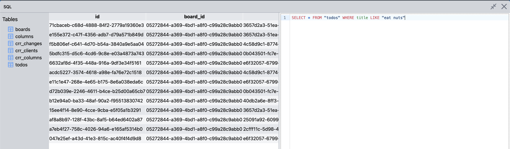

# Teilen SQL

Replicate your sqlite3 database tables and sync them to other clients with automatic conflict resolution.

Upgrade tables to be crr's (Conflict-Free Replicated Relations) https://inria.hal.science/hal-02983557v1/document

This project is heavily inspired by the cr-sqlite project by Matt Wonlaw so check that out: https://github.com/vlcn-io/cr-sqlite

This framework is purely in javascript/typescript working on-top of wa-sqlite to have sqlite in the browser. Being in javascript rather than a compiled wasm-module means its easier to debug and understand what is going on. Ofc, this has the disadvantage of tying any use of this framework to also be in javascript. Roadmap is to port the core into a C or Rust library at some point for performance and just provide simple database wrappers for a handful of different languages to make it more interoperable.

## \*\*\*Disclaimer\*\*\*
This library is not really made for production use yet as its still very experimental. Use it at your own will

## Features

⚡️ Reactive sql queries through a React hook

🚸 Automatic conflict-resolution of inserts, updates and deletes

🔀 Distributed fractional indicies for ordering of rows

🛜 Network agnostic. Changes can be sent over the network to be merged or they can stay local till connectivity is back


## Tables as CRR's

Tables can be updated to be crr's or replicated tables
```ts
// db setup ...

// Make the tables into crr's
await db.upgradeTableToCrr("boards");
await db.upgradeTableToCrr("todos");
await db.upgradeTableToCrr("lists");

await db.finalizeUpgrades();
```

## Distributed Fractional indicies
Columns in a table can be updated to be fractional indicies to put an ordering to rows.

Fractional indicies are great as they only require an update to the single row that needs to be moved or inserted. If we have two rows with order 0.0 and 1.0 and we wanted a third row in-between, we give the new row order 0.5. 

Fractional indicies in teilen-sql uses the same principle with a few additions to make it distributed.

* The fraction is represented as a base52 string to make it arbitrary precision.
* Two rows with the same ordering (conflicting) are automatically resolved on inserts

```js
// Update the 'position' field to be a fractional index
await db.upgradeColumnToFractionalIndex("todos", "position", "column_id");
```
```sql
-- The 'position' column now accepts three values:
--  '|append'       : Append to the list
--  '|prepend'      : Prepend to the list
--  after_id        : The primary-key to place this row after 
INSERT INTO "todos" VALUES ('1', 'Buy milk', '|append')
INSERT INTO "todos" VALUES ('2', 'Eat lunch', '|append')
INSERT INTO "todos" VALUES ('3', 'Plan dinner', '1') -- place after row with id 1 (in-between 1 and 2)

┌─────────────────────────────────┐
│ id   │    title      │ position │
├─────────────────────────────────┤
│ '1'  │ 'Buy milk'    │   'a'    │
├─────────────────────────────────┤
│ '3'  │ 'Plan dinner' │   'h'    │
├─────────────────────────────────┤
│ '2'  │ 'Eat lunch'   │   'n'    │
└─────────────────────────────────┘
```

Figma has a great blog-post that explains fractional indicies:
https://www.figma.com/blog/realtime-editing-of-ordered-sequences/

Also Matt Wonlaw has an execellent video on how fractional indicies work in cr-sqlite:
https://www.youtube.com/watch?v=BghFgK6VJIE

## ⚛️ React


### SqliteContext
Teilen-sql provides the ```SqliteContext``` to give child components access to the db instance.
```jsx
import { createDb } from "@jakobsaadbye/teilen-sql"
import { SqliteContext } from "@jakobsaadbye/teilen-sql/react"

const db = await createDb("example.db");

createRoot(document.getElementById('root') as HTMLElement).render(
  <StrictMode>
    <SqliteContext.Provider value={db}>
      <App />
    </SqliteContext.Provider>
  </StrictMode>,
)

```

### useQuery\<T>
The ```useQuery``` hook is the primary way to query data from the database. The query re-runs everytime there is a change to the affected table of the query. 

```jsx
export const TodoList = () => {
    const todos = useQuery<Todo[]>(`SELECT * FROM "todos"`, []).data;

    return (
        <div className="flex flex-col items-center justify-center">
            {todos && todos.map(todo => <p>{todo.title}</p>)}
        </div>
    )
}
```

```ts
useQuery<T>(sql: string | QueryFunc, params: any[], options: UseQueryOptions)

// A QueryFunc is just any function that accepts the db as the first argument and returns data. 
// All the values in the 'params' list are passed to the function.
// Mostly used if you want to delegate out complex queries into a function that live elsewhere. 
// NOTE: You need to specify the list of table dependencies for the function to re-run in the query options
type QueryFunc<T> = (db: SqliteDB, ...params: any) => Promise<T>;

type UseQueryOptions = {
    fireIf?: boolean        // A condition to be true before executing
    once?: boolean          // If the query only should run once when the component mounts
    first?: boolean         // Get the first matching result, undefined if no result
    dependencies?: string[] // List of table names that if updated re-runs the query. Only needed to be specified if passed a function. Otherwise the affected table is infered from the sql query by sqlite EXPLAIN QUERY PLAN
}
```

## 🔍 Inspector

Press ```ctrl+i``` anywhere to open the inspector. The inspector lets you inspect and modify the sqlite database that's running in the application.

The design is heavily inspired by [TablePlus](https://tableplus.com/), with most of the same keybindings and features.

Its build on the same reactivity system as the rest of the components, so any changes done via the inspector, is immediately reflected in the application.

