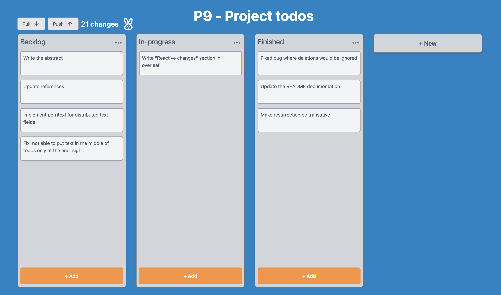
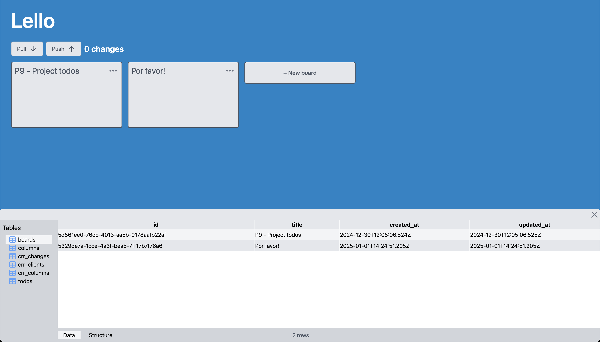

# Lello
A trello inspired project board application built with teilen-sql



Collaborate on the board by syncing changes to others.

<video width="100%" height="400" controls autoplay>
  <source src="demo.mov" type="video/mp4">
</video>

https://github.com/jakobsaadbye/teilen-sql/blob/main/demos/Lello/demo.mov

## Quick start

Install deno if not already installed:
https://docs.deno.com/runtime/getting_started/installation/

macOS:
```console
curl -fsSL https://deno.land/install.sh | sh
```
Windows:
```console
irm https://deno.land/install.ps1 | iex
```

Then in both the client and server directory run:

```cmd
deno run dev
```

## Table Viewer

Press ```ctrl+d``` anywhere to open the table viewer. The table viewer lets you inspect and modify the sqlite database thats running in the application.

Its build on the same reactivity system as the rest of the components, so any changes done via the table viewer, is immediately reflected in the application.

